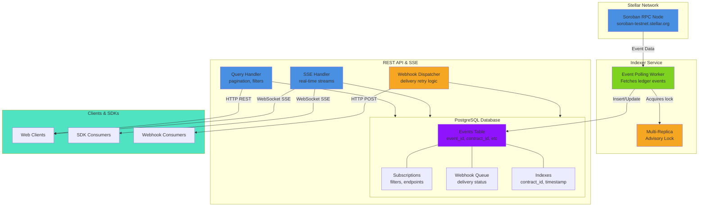

# System Architecture

## Overview

Soroban Pulse is a lightweight Rust backend service that indexes Soroban smart contract events on the Stellar network and exposes them via a REST API with real-time streaming capabilities.

## Architecture Diagram



## Core Components

### 1. Stellar RPC Integration
- **Soroban RPC Node**: Primary event source from the Stellar network
- Configured via `STELLAR_RPC_URL` environment variable
- Defaults to testnet: `https://soroban-testnet.stellar.org`

### 2. Indexer Worker
- **Location**: `src/indexer.rs`
- **Functionality**:
  - Continuously polls Soroban RPC for new contract events
  - Processes events in batches for efficiency
  - Implements exponential backoff for network failures
  - Tracks last processed ledger to resume gracefully

### 3. Multi-Replica Advisory Lock Mechanism
- **Purpose**: Prevents multiple instances from indexing simultaneously
- **Implementation**: PostgreSQL advisory locks
- **Configuration**:
  - `INDEXER_LOCK_RETRY_SECS`: Retry interval for standby replicas (default: 30 seconds)
- **Flow**:
  1. Primary replica acquires advisory lock on startup
  2. Standby replicas wait for lock release
  3. On primary failure, standby acquires lock and takes over
  4. Lock is held for the duration of the indexing process

### 4. PostgreSQL Database
- **Schema**: See [docs/schema.md](schema.md)
- **Key Tables**:
  - `events`: Indexed contract events
  - `subscriptions`: User-created filter subscriptions
  - `webhook_queue`: Pending webhook deliveries
  - `notification_queue`: Processed notifications
- **Indexes**: Optimized for high-cardinality lookups (contract_id, timestamp)

### 5. REST API & SSE
- **Location**: `src/routes.rs`, `src/handlers.rs`
- **Query Handler**:
  - Supports pagination with cursor-based or offset navigation
  - Filter validation with regex and bloom filters
  - Timestamp range filtering
  - Response caching headers

- **SSE Handler** (Server-Sent Events):
  - Real-time event streaming for connected clients
  - Keep-alive pings every `SSE_KEEPALIVE_SECS` (default: 15 seconds)
  - Subscription filtering applied per-connection
  - Automatic reconnection support

- **Webhook Dispatcher**:
  - Delivers events to registered webhook endpoints
  - Retry logic with exponential backoff
  - HMAC-SHA256 signature verification for authenticity
  - Configurable timeout and concurrency limits

### 6. Authentication & Rate Limiting
- **API Key Authentication**: Optional via `API_KEY` environment variable
- **Admin Authentication**: Separate `ADMIN_API_KEY` for protected endpoints
- **Rate Limiting**: Per-IP per-minute limits (configurable via `RATE_LIMIT_PER_MINUTE`)

## Event Flow

```
┌─────────────────────────────────────────────────────────────┐
│                    EVENT LIFECYCLE                          │
├─────────────────────────────────────────────────────────────┤
│                                                              │
│  1. [Stellar RPC] Emits contract event                      │
│     ↓                                                        │
│  2. [Indexer] Polls and detects new event                  │
│     ↓                                                        │
│  3. [Advisory Lock] Ensures single writer (multi-replica)  │
│     ↓                                                        │
│  4. [Database] Stores event (if not duplicate)             │
│     ↓                                                        │
│  5. [Content Filter] Applies subscription filters          │
│     ↓                                                        │
│  6a. [SSE] Pushes to real-time subscribers                 │
│  6b. [Webhook] Queues for async delivery                   │
│  6c. [REST] Available for query via API                    │
│                                                              │
└─────────────────────────────────────────────────────────────┘
```

## Deployment Architecture

### Local Development
```
Developer Machine
├── PostgreSQL (Docker)
├── Soroban Pulse Binary
├── .env configuration
└── REST API on :3000
```

### Production (Kubernetes)
- **High Availability**: 2-3 replicas with load balancer
- **Database**: Managed PostgreSQL with automated backups
- **Indexer**: Single active replica (advisory lock based)
- **API**: Stateless, horizontally scalable
- **Metrics**: Prometheus scraping on `/metrics`
- **Health Checks**: `/health` and `/healthz/*` endpoints

## Performance Considerations

### Pagination
- **Cursor-based**: Efficient for large result sets
- **Offset-based**: Simple but slower for large offsets
- Default page size: 100 events (configurable)
- **Property-based testing**: See Issue #554

### Indexing Strategy
- Events indexed on `contract_id`, `timestamp`, `event_id`
- Bloom filters for deduplication (Issue #266)
- Regular index usage monitoring (`INDEX_CHECK_INTERVAL_HOURS`)

### Rate Limiting
- Token-bucket algorithm per IP
- Per-channel notification throttling (Issue #476)
- Governor library for efficient rate limit enforcement

### Slow Query Logging
- Queries exceeding `SLOW_QUERY_THRESHOLD_MS` logged at WARN level
- Tracked in metrics for performance monitoring

## Testing & Quality Assurance

### Test Suites
1. **Unit Tests**: Individual module functionality
2. **Integration Tests**: Database and API interactions
3. **Property-Based Tests**: Edge case discovery via `proptest` (Issue #554)
4. **Mutation Testing**: Test quality verification via `cargo-mutants` (Issue #555)
5. **Contract Tests**: API contract verification with Pact (Issue #556)

See [Testing & Quality Assurance](#testing--quality-assurance) in the respective issues for detailed implementation.

## Configuration

All configuration is environment-driven. See the main [README.md](../README.md) for the complete list of environment variables and their descriptions.

Key architectural settings:
- `DATABASE_URL`: PostgreSQL connection string
- `STELLAR_RPC_URL`: Soroban RPC endpoint
- `INDEXER_LOCK_RETRY_SECS`: Multi-replica lock retry interval
- `SSE_KEEPALIVE_SECS`: Server-sent events keep-alive interval
- `SLOW_QUERY_THRESHOLD_MS`: Slow query logging threshold

## Security

- **XDR Validation**: Stellar XDR envelope validation (Issue #267)
- **HMAC Verification**: Webhook signature validation using HMAC-SHA256
- **Encryption**: AES-GCM for sensitive data at rest (optional feature)
- **Input Validation**: Schema validation for all API inputs
- **SQL Injection Prevention**: Parameterized queries via SQLx

## Related Issues & Features

- **Issue #266**: Bloom filter deduplication
- **Issue #267**: XDR validation
- **Issue #476**: Token-bucket rate limiting for per-channel notification throttling
- **Issue #553**: Architecture diagram (this document)
- **Issue #554**: Property-based testing with proptest
- **Issue #555**: Mutation testing for quality assurance
- **Issue #556**: API contract tests with Pact
